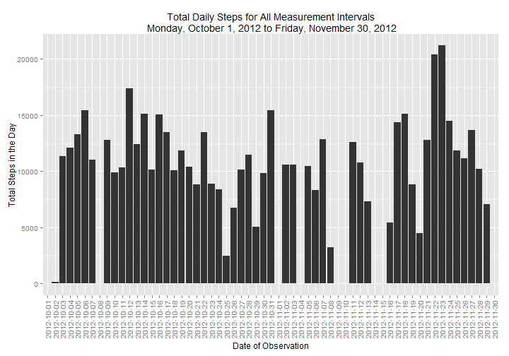
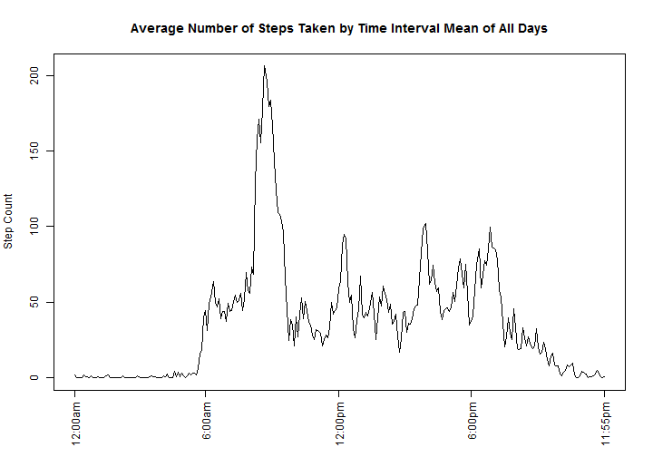
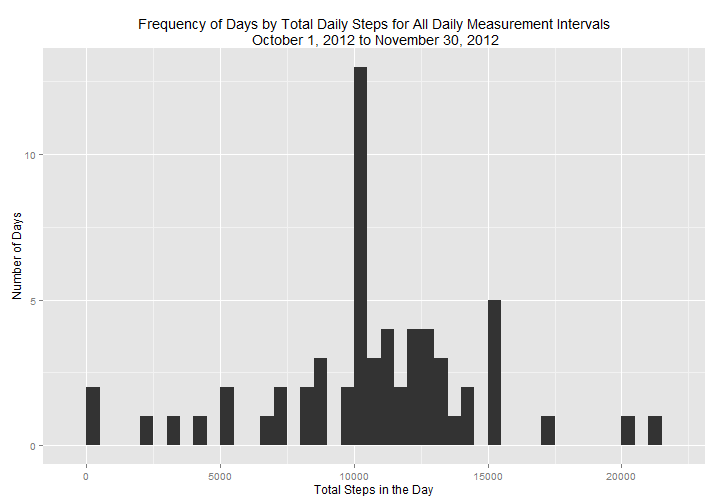
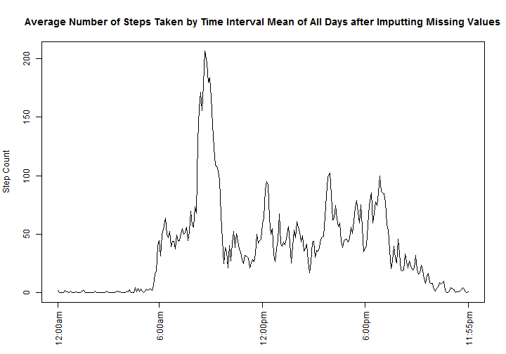
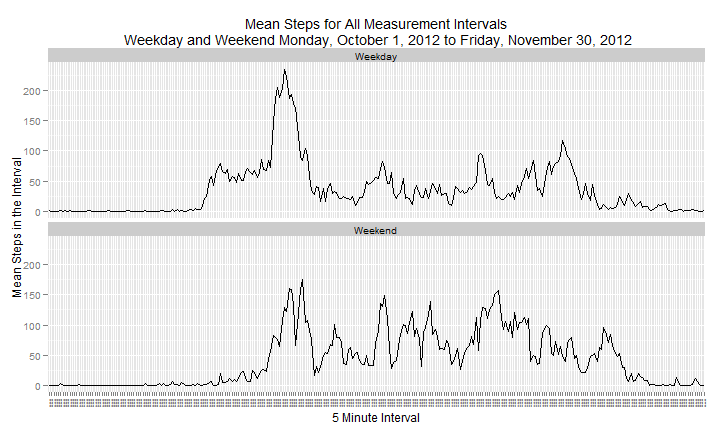
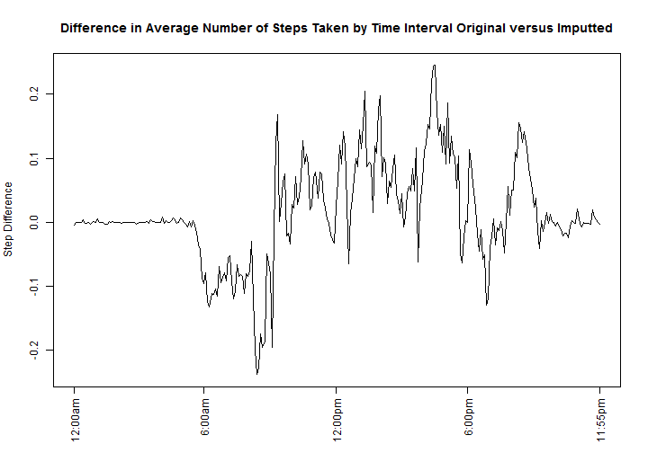

### Introduction

My wife bought me a "fitbit" late September 2012 and bet me that I couldn't put 12,000 steps a day on it from the beginning of October to the end of November. I said that I could easily do 12,000 steps per in a day but I wanted the standard to be an average of 12,000 steps per day over this period.  We agreed to those terms and I was quite confident that I would win and took the bet.  I really worked hard.  When I downloaded a file from fitbit in December, the summary data showed that I had only a total of 570,608 steps, not the 12,000 steps per day I would want over 61 days of monitoring.


```r
url<-"http://d396qusza40orc.cloudfront.net/repdata%2Fdata%2Factivity.zip"

download.file(url, destfile = "activity.zip", mode="wb") 
unzip("activity.zip", files = NULL, list = FALSE, overwrite = TRUE,
      junkpaths = FALSE, exdir = ".", unzip = "internal",
      setTimes = FALSE)
p = read.csv("activity.csv", header=TRUE, row.names=NULL, 
 stringsAsFactors=FALSE)
require(plyr)
```

```
## Loading required package: plyr
```

```r
p1<-aggregate(p$steps, by=list(p$date), "sum", na.rm=TRUE)
sum(p1$x, na.rm=TRUE)
```

```
## [1] 570608
```

I didn't understand why the number was so low. I put a lot of steps in over Thanksgiving and I made it a point to exercise andwalk as much as I could.  I really worked hard over these two months.  Since I had taken Coursera's "Getting and Cleaning Data" course from Johns Hopkins Bloomberg School of Public Health, I knew that I could analyze the data and clean it up to see if there were obvious problems.

The raw data needed to be processed for me to get a better understanding of it.  I needed to have graphics as well as tabular information.  So there were a number of variables that I needed to clean and some new variables I needed to create to help me tell my story and win my bet.  I looked at the data.  The dimensions were 17568 by 3.  The variables were steps, date, and interval.  The steps variable was a count of the number of steps taken on the particular date during a particular 5 minute interval.  When I thought about it, I was looking at data that represented 288 intervals (60/5 x 24) and included 61 days.  The format of the date variable was character so that was fine but the interval variable was in an abbreviated format. It was not a traditional hour, minute, second format but a format that left trimmed any leading "0"s.  That wasn't going to work on my explanatory graphics so I created a new variable by replicating the components of an hour, minute, second format over 61 days.  The variable had the necessary 17,568 length.  

I also wanted to easily track down the day of the week and whether it was a weekday or weekend.  So I converted the a date variable from character, loaded the "lubridate" package and created a variable showing day of the week and one also distinguishing weekday from weekend. I thought it would be helpful to structure these variables as factors.  Cbinding these together, I had the makings of a workable dataset.


```r
ti<-rep(c("00:","01:", "02:","03:", "04:", "05:","06:", "07:","08:", "09:", "10:","11:", "12:","13:", "14:", "15:","16:", "17:","18:", "19:","20:","21:", "22:","23:"), each=12)
me<-rep(c("00:00", "05:00","10:00","15:00","20:00","25:00", "30:00","35:00","40:00","45:00","50:00","55:00"), 24)
ti_me<-paste(ti,me,sep="",collapse=NULL)
time<-rep(ti_me,61)
p2<-cbind(p,time)
p2$time<-as.character(p2$time)
p2$interval<-as.factor(p2$interval)
```


```r
require(lubridate)
```

```
## Loading required package: lubridate
## 
## Attaching package: 'lubridate'
## 
## The following object is masked from 'package:plyr':
## 
##     here
```

```r
date1<-as.Date(p2$date)
day<-wday(date1, label = TRUE, abbr = TRUE)
p3<-cbind(date1,day,p2)
p3$weekend<-p3$day=="Sun" | p3$day=="Sat" #weekend thus = TRUE
p3$weekend<-as.factor(p3$weekend)
levels(p3$weekend)[levels(p3$weekend)=="TRUE"] <- "Weekend"
levels(p3$weekend)[levels(p3$weekend)=="FALSE"] <- "Weekday"
```

Since I like creating useful graphics, my first step was to create a bar chart of my daily steps. Boy was I surprised!.  It looked like I had no steps at all some days and very few on others.  I was glad to see that my heavy Thanksgiving activity was counted but these extremely low days were dragging me down. 


```r
require(plyr)
require(ggplot2)
```

```
## Loading required package: ggplot2
```

```r
require(gridExtra)
```

```
## Loading required package: gridExtra
## Loading required package: grid
```

```r
daysteps<-aggregate(p3$steps, by=list(p3$date), "sum", na.rm=TRUE)
names(daysteps)<-c("date", "dailysteps")
a=ggplot(daysteps, aes(x=date, y=dailysteps)) +geom_bar(stat="identity", fill=date)+
       xlab("Date of Observation") + ylab("Total Steps in the Day") +
       ggtitle("Total Daily Steps for All Measurement Intervals\n Monday, October 1, 2012 to Friday, November 30, 2012") +
       theme(axis.text.x=element_text(angle=90,hjust=1,vjust=0.5))
a
```

 

```r
daysteps1<-subset(daysteps, daysteps$dailysteps>0)
median(daysteps$dailysteps)
```

```
## [1] 10395
```

```r
mean(daysteps$dailysteps)
```

```
## [1] 9354
```

```r
mean(daysteps1$dailystep)#daysteps1 subsets out the zero days.
```

```
## [1] 10766
```

My mean steps per day in October and November was 9,354, the median steps per day was 10,395 To get more perspective, I made a histogram of the my daily steps and it showed me how far I needed to go and where I needed to boost up my average.  It occurred to me that my mean figure was averaged over all of the 61 days rather the 53 days that actually had readings. With that adjustment, my means steps increased to 10,766 which made me feel better.  


Looking at the data, I started by checking out the NA values in my summary.  There were 2304 NA values in the dataset.  They were all clustered together over 8 days, 288 missing readings over 8 days.  I must have forgotten to turn on my fitbit!  That was something I needed to address but I'm not sure that it would affect my average since with excluded NA's was there going to be any difference.  I identified these NA dates and days of the week.  I couldn't help thinking that some days where my fitbit was on and charged I may have left it on my dresser for periods of time. These could account for my sub-12,000 step outcome.


```r
sum(p3$steps,na.rm=TRUE)
```

```
## [1] 570608
```

```r
summary(p3$steps)
```

```
##    Min. 1st Qu.  Median    Mean 3rd Qu.    Max.    NA's 
##     0.0     0.0     0.0    37.4    12.0   806.0    2304
```

```r
with(p3,table(is.na(p3$steps), p3$date))
```

```
##        
##         2012-10-01 2012-10-02 2012-10-03 2012-10-04 2012-10-05 2012-10-06
##   FALSE          0        288        288        288        288        288
##   TRUE         288          0          0          0          0          0
##        
##         2012-10-07 2012-10-08 2012-10-09 2012-10-10 2012-10-11 2012-10-12
##   FALSE        288          0        288        288        288        288
##   TRUE           0        288          0          0          0          0
##        
##         2012-10-13 2012-10-14 2012-10-15 2012-10-16 2012-10-17 2012-10-18
##   FALSE        288        288        288        288        288        288
##   TRUE           0          0          0          0          0          0
##        
##         2012-10-19 2012-10-20 2012-10-21 2012-10-22 2012-10-23 2012-10-24
##   FALSE        288        288        288        288        288        288
##   TRUE           0          0          0          0          0          0
##        
##         2012-10-25 2012-10-26 2012-10-27 2012-10-28 2012-10-29 2012-10-30
##   FALSE        288        288        288        288        288        288
##   TRUE           0          0          0          0          0          0
##        
##         2012-10-31 2012-11-01 2012-11-02 2012-11-03 2012-11-04 2012-11-05
##   FALSE        288          0        288        288          0        288
##   TRUE           0        288          0          0        288          0
##        
##         2012-11-06 2012-11-07 2012-11-08 2012-11-09 2012-11-10 2012-11-11
##   FALSE        288        288        288          0          0        288
##   TRUE           0          0          0        288        288          0
##        
##         2012-11-12 2012-11-13 2012-11-14 2012-11-15 2012-11-16 2012-11-17
##   FALSE        288        288          0        288        288        288
##   TRUE           0          0        288          0          0          0
##        
##         2012-11-18 2012-11-19 2012-11-20 2012-11-21 2012-11-22 2012-11-23
##   FALSE        288        288        288        288        288        288
##   TRUE           0          0          0          0          0          0
##        
##         2012-11-24 2012-11-25 2012-11-26 2012-11-27 2012-11-28 2012-11-29
##   FALSE        288        288        288        288        288        288
##   TRUE           0          0          0          0          0          0
##        
##         2012-11-30
##   FALSE          0
##   TRUE         288
```

```r
b=ggplot(daysteps, aes(x=dailysteps)) + geom_histogram(binwidth = 500) +
       xlab("Total Steps in the Day") + ylab("Number of Days") +
       ggtitle("Frequency of Days by Total Daily Steps for All Daily Measurement Intervals\n October 1, 2012 to November 30, 2012")
b
```

 


Setting that aside, I then was curious about at my daily activity pattern over the 288 time intervals to identify if there were time intervals that seemed off.  That was informative but not very useful for my purpose. 


The pattern was as I would have expected, a peak at about in the early part of the morning representing my twice a week jog.  This peak was on top of a variable base that looked to be a little more than 50 steps per interval and tailed off around bedtime.  Probably need to jog more often or walk more deliberately during the day.  It was interesting in that my peak time was 8:35 am with an average of 206.2 steps per five minute period.  I could jog 1/2 of a mile in that time which is 850 steps so the averaging is taking its toll.


```r
dailysteps_all<-aggregate(p3$steps, by=list(p3$time), "mean", na.rm=TRUE)
aa<-plot(dailysteps_all[,2], type="l", ylab="Step Count", xlab=NA, main="Average Number of Steps Taken by Time Interval Mean of All Days", xaxt="n")
axis(1,at=c(1,72,144,216,288),las=2,lab = c("12:00am","6:00am","12:00pm","6:00pm","11:55pm"))
```

 

```r
aa
```

```
## NULL
```

```r
names(dailysteps_all)<-c("Time_24hrFormat", "Ave_Steps")
highest<-dailysteps_all[with(dailysteps_all, order(-Ave_Steps)),]
head(highest,1) #am
```

```
##     Time_24hrFormat Ave_Steps
## 104        08:35:00     206.2
```

## Revisiting My Numbers ##

I need to find a defensible way to adjust my steps by imputing more real values in those places where my readings show are missing.  

I think I will be very specific about the interval pattern that I use to replace the NAs.  So, my eight missing dates are Monday, Oct. 1,  Monday, Oct. 8, Thursday, Nov. 1, Sunday, Nov.4, Friday, Nov 9, Saturday, Nov. 10, Wednesday, Nov 14 and Friday, Nov.30.  So six weekdays and  two weekend days.    
    
I'll want to substitute use the missing data for the respective weekday and weekend patterns.  To calculate my weekend and weekday pattern I will use the basic logic that I used for the all day pattern, subsetted by the factor variable weekend. 


```r
dailysteps_wkend<-aggregate(p3$steps[p3$weekend=="Weekend"], by=list(p3$time[p3$weekend=="Weekend"]), "mean", na.rm=TRUE)
dailysteps_Weekday<-aggregate(p3$steps[p3$weekend=="Weekday"], by=list(p3$time[p3$weekend=="Weekday"]), "mean", na.rm=TRUE)
```

Then I'll change the step values for the missing days to the step values for the weekend and weekday averages.


```r
p3$steps[p3$date=="2012-10-01"]<-dailysteps_Weekday$x
p3$steps[p3$date=="2012-10-08"]<-dailysteps_Weekday$x
p3$steps[p3$date=="2012-11-01"]<-dailysteps_Weekday$x
p3$steps[p3$date=="2012-11-04"]<-dailysteps_wkend$x
p3$steps[p3$date=="2012-11-09"]<-dailysteps_Weekday$x
p3$steps[p3$date=="2012-11-10"]<-dailysteps_wkend$x
p3$steps[p3$date=="2012-11-14"]<-dailysteps_Weekday$x
p3$steps[p3$date=="2012-11-30"]<-dailysteps_Weekday$x
```


```r
daysteps2<-aggregate(p3$steps, by=list(p3$date), "sum", na.rm=TRUE)
names(daysteps2)<-c("date", "dailysteps")
require(ggplot2)
c=ggplot(daysteps2, aes(x=date, y=dailysteps)) +geom_bar(stat="identity", fill=date)+
       xlab("Date of Observation") + ylab("Total Steps in the Day") +
       ggtitle("Imputed Total Daily Steps for All Measurement Intervals\n Monday, October 1, 2012 to Friday, November 30, 2012") +
       theme(axis.text.x=element_text(angle=90,hjust=1,vjust=0.5))
c
```

 


Both the new barplot and the historgram show that I have successfully imputted new data into the values for the missing days.

```r
d=ggplot(daysteps2, aes(x=dailysteps)) + geom_histogram(binwidth = 500) +
       xlab("Total Steps in the Day") + ylab("Number of Days") +
       ggtitle("Frequency of Days by Total Daily Steps for All Daily Measurement Intervals\n October 1, 2012 to November 30, 2012")
d
```

 


However, my median and means do not seem to have changed.  Not a surprise since I didn't change any important pattern like adjusting those very low days with my fitbit on but laying on my desk.

```r
mean(daysteps2$dailysteps)
```

```
## [1] 10762
```

```r
median(daysteps2$dailysteps)
```

```
## [1] 10571
```


```r
dailysteps_all2<-aggregate(p3$steps, by=list(p3$time), "mean", na.rm=TRUE)
e<-plot(dailysteps_all2[,2], type="l", ylab="Step Count", xlab=NA, main="Average Number of Steps Taken by Time Interval Mean of All Days after Imputting Missing Values", xaxt="n")
axis(1,at=c(1,72,144,216,288),las=2,lab = c("12:00am","6:00am","12:00pm","6:00pm","11:55pm"))
```

 


```r
dailysteps_wkend<-aggregate(p3$steps[p3$weekend=="Weekend"], by=list(p3$time[p3$weekend=="Weekend"]), "mean", na.rm=TRUE)
dailysteps_Weekday<-aggregate(p3$steps[p3$weekend=="Weekday"], by=list(p3$time[p3$weekend=="Weekday"]), "mean", na.rm=TRUE)
bb<-plot(dailysteps_wkend[,2], type="l", ylab="Step Count", xlab=NA, main="Average Number of Steps Taken by Time Interval Mean of Weekend Days", xaxt="n")
axis(1,at=c(1,72,144,216,288),las=2,lab = c("12:00am","6:00am","12:00pm","6:00pm","11:55pm"))
```

```r
cc<-plot(dailysteps_Weekday[,2], type="l", ylab="Step Count", xlab=NA, main="Average Number of Steps Taken by Time Interval Mean of Weekday Days", xaxt="n")
axis(1,at=c(1,72,144,216,288),las=2,lab = c("12:00am","6:00am","12:00pm","6:00pm","11:55pm"))
```

If I look separately at the weekdays and the weekends, I see a definite pattern between weekend and weekday but that had already existed before imputing.


```r
z= aggregate(steps~weekend + time, data=p3, mean)
k=ggplot(z, aes(x= time,y=steps, group = weekend)) + geom_line() + facet_wrap(~weekend, ncol=1) + xlab("5 Minute Interval") + ylab("Mean Steps in the Interval") +
       ggtitle("Mean Steps for All Measurement Intervals\n Weekday and Weekend Monday, October 1, 2012 to Friday, November 30, 2012") +
       theme(axis.text.x=element_text(angle=90,size=2, hjust=1,vjust=0.5))

k 
```

 


The following plot shows the very small differences between the before and after imputation.

```r
diff_all<-as.data.frame(dailysteps_all$Ave_Steps-dailysteps_all2$x)
names(diff_all)<-"diffsteps"
df_diff<-cbind(dailysteps_all[,1], diff_all)
names(df_diff)<-c("interval", "diffsteps")
plot(df_diff$diffsteps, type="l", ylab="Step Difference", xlab=NA, main="Difference in Average Number of Steps Taken by Time Interval Original versus Imputted", xaxt="n")
axis(1,at=c(1,72,144,216,288),las=2,lab = c("12:00am","6:00am","12:00pm","6:00pm","11:55pm"))
```

 

In conclusion, I won't win my bet.  Maybe I should adjust the other low steps days?

